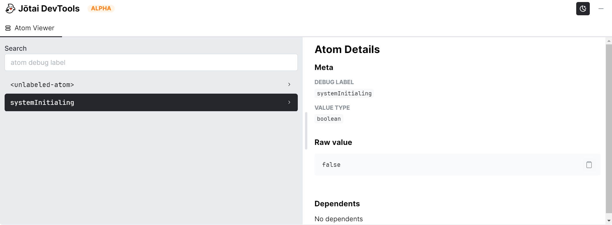

## Jotai debugging document
We use [Jotai devtools](https://jotai.org/docs/tools/devtools)
which is Jotai officially provided to debug,it only works in a non-production environment.

To have a better debug experience,atom should be exported at the **first level** instead of wrapped in an object,otherwise it will be displayed as `<unlabeled-atom>`.
```jsx
// right example1:
export const isLogin = atom(false)
// right example2:
const isLogin = atom(false)
export default isLogin
// wrong example:
export default {
  isLogin: atom(false)
}
```

For more information, see the [official documentation](https://jotai.org/docs/guides/debugging),
