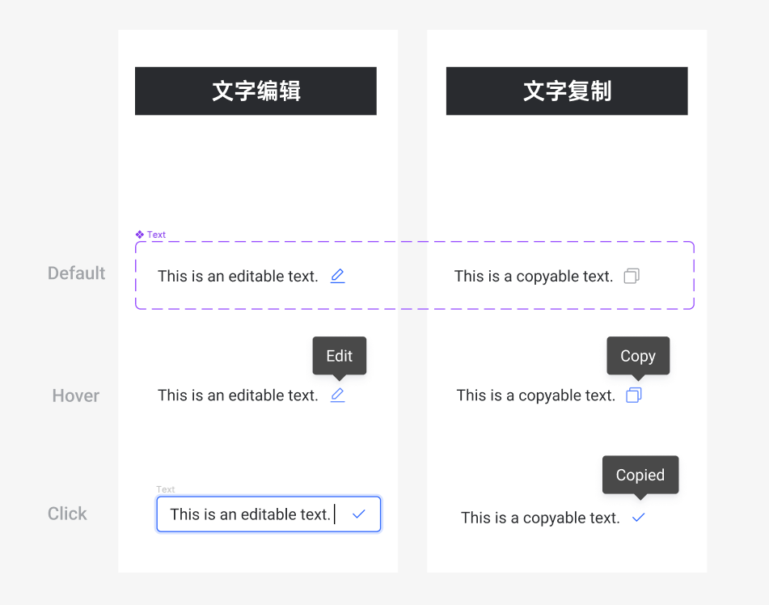

# 说明文档

## EditableText
the component is editable when `onChange` property is passed. the component turn into edit mode when user click the edit icon. the changed content will be aborted if user leave edit mode by `ESC`, just call onChange when user enter `ENTER`

## CopyableText
the component support all `Typography.Paragraph` props from antd. just preset default icon.